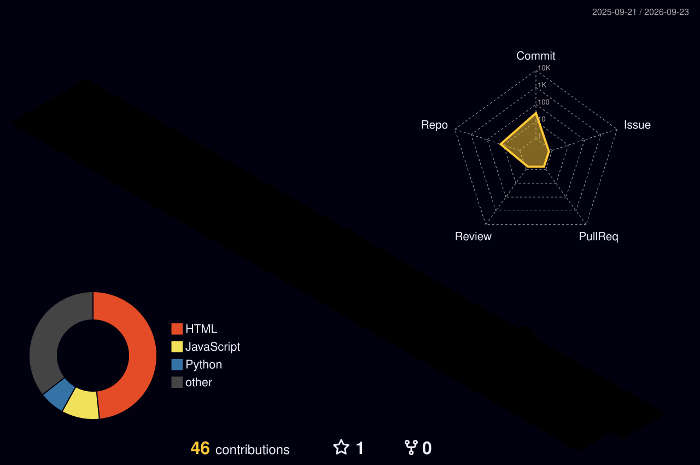

<h1 align="center">Hi 👋, I'm Lokraj Joshi</h1>

<h3 align="center">
MCA Student | Software Developer | Full Stack & Automation Enthusiast
</h3>

  

  💻 Building practical, scalable and reliable software solutions 🚀

---

## 👨‍💻 About Me

- 🎓 Currently pursuing **MCA at CHRIST (Deemed to be University), Bengaluru**
- 💻 Passionate about **Software Development, Full Stack Development, Automation and Data-driven applications**
- 🐍 Skilled in **Python, Java, C, SQL and JavaScript**
- ⚙️ Building projects using **React, Node.js, Express and MongoDB**
- 🧪 Hands-on experience with **API Testing, Selenium and Postman**
- 💼 Former **Senior Technician at Dell Technologies** with around **1 year of professional experience**
- 🚀 Former **SAP Labs India Intern**, working with automation and software testing
- 🐍 Completed a **Python Internship at InternPe**
- 🤝 Former **Dell Technologies Campus Ambassador**
- 🔧 Comfortable with **Git, GitHub, VS Code, IntelliJ and modern development workflows**
- 📚 Focused on continuously improving my skills and building practical, scalable solutions

---

## 🛠️ Tech Stack

### 💻 Programming Languages

  

### ⚙️ Full Stack Development

  

### 🗄️ Databases

  

### 🔧 Development Tools

  

### 🧪 Testing & API

  
  

---

## 🚀 Featured Projects

### 🎓 Student Learning Management System

**Full Stack MERN application for managing student information and academic workflows.**

`React` `Node.js` `Express` `MongoDB`

🔗 [View Repository](https://github.com/Lokrajjoshi/joshi-lms-react)

---

### 📊 Student Project Tracker

**CRUD-based project tracking system for managing student project information and submissions.**

`React` `Node.js` `Express` `MongoDB`

🔗 [View Repository](https://github.com/Lokrajjoshi/CIA3-Student-Tracker-System)

---

### 🎮 Dell Trivia Game

**Interactive browser-based trivia application built using JavaScript.**

`JavaScript` `HTML` `CSS`

🔗 [View Repository](https://github.com/Lokrajjoshi/dell-trivia-game)

---

## 💼 Professional Experience

### 💻 Dell Technologies
**Senior Technician**

- Provided technical troubleshooting and system support
- Worked with customer issues, diagnostics and resolution workflows
- Built strong problem-solving and technical communication skills

### 🚀 SAP Labs India
**Automation Testing Intern**

- Worked on API testing and automation
- Developed reusable automation components
- Used Java, Selenium, Postman, Git and IntelliJ

### 🐍 InternPe
**Python Intern**

- Built Python scripts for automation and file handling
- Worked with debugging and data manipulation
- Used Git for version control

### 🤝 Dell Technologies
**Campus Ambassador**

- Represented Dell Technologies on campus
- Supported technical workshops and student engagement
- Connected students with technology initiatives

---

## 📊 GitHub Analytics

  

  

---

## 🌌 3D Contribution Graph

  

---

## 🐍 Contribution Activity

  

---

## 🏆 Highlights

- 🎓 Pursuing **Master of Computer Applications**
- 💼 Around **1 year of professional experience at Dell Technologies**
- 🚀 Former **SAP Labs India Intern**
- 🐍 Python Internship experience
- 🤝 Former **Dell Technologies Campus Ambassador**
- 💻 Building Full Stack MERN applications
- 🧪 Experience with Automation and API Testing

---

## 🤝 Connect With Me

---

  <i>“Always Learning • Always Building • Always Improving”</i>

  ⭐ Thanks for visiting my profile!

