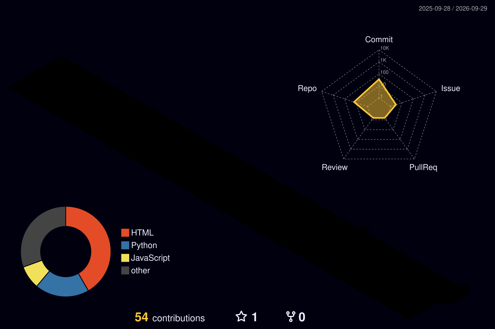

<div align="center">


# ⚡ LOKRAJ JOSHI

### Full-Stack Developer · Automation Engineer · MCA Candidate


<p><a href="https://github.com/Lokrajjoshi"></a> <a href="https://www.linkedin.com/in/lokraj-joshi11/"></a> <a href="mailto:joshlokraj63@gmail.com"></a></p>

</div>

---

## 🧭 Engineering Identity

```yaml
name: Lokraj Joshi
identity_mark: LJ | Joshi
location: Bengaluru, India
current_status: MCA Student at CHRIST (Deemed to be University)
professional_experience: 1 year at Dell Technologies
engineering_focus:
  - Full-Stack Systems
  - Test Automation
  - API Engineering
  - Scalable Workflows
working_principles:
  - Solve the real problem first
  - Design workflows that are easy to test
  - Build reliable, maintainable software
  - Improve every iteration
```

## 🧠 The LJ Engineering Loop

I combine **technical support empathy**, **automation discipline**, and **full-stack systems thinking** to turn ambiguous problems into dependable software.

```text
Understand → Design → Build → Test → Measure → Improve
```

## 💼 Experience

| Organization | Role | What I Delivered |
|---|---|---|
| **Dell Technologies** | **Senior Technician · 1 year of professional experience** | Resolved hardware, software, OS, and connectivity issues through diagnostics, documentation, and clear customer communication. |
| **SAP Labs India** | Automation Testing Intern | Worked with Java, Postman, Selenium, Git, API testing, debugging, and reusable automation workflows. |
| **InternPe** | Python Intern | Built Python scripts for automation, file handling, debugging, and data manipulation. |
| **Dell Technologies** | Campus Ambassador | Supported outreach, technical workshops, student engagement, and collaboration. |

## 🧰 Technology System

### Languages
<p>    </p>

### Full Stack
<p>   </p>

### Automation & Tools
<p>     </p>

---

## 🚀 Featured Systems

| Project | Architecture | Key Technical Work | Link |
|---|---|---|---|
| **CarePulse / Student LMS** | React → Node.js/Express → MongoDB | Full-stack workflows for student information, academic operations, authentication, dashboards, and structured data. | [Repository](https://github.com/Lokrajjoshi/joshi-lms-react) |
| **Student Project Tracker** | React → Node.js/Express → MongoDB | CRUD tracking for student projects, submissions, progress, and academic information. | [Repository](https://github.com/Lokrajjoshi/CIA3-Student-Tracker-System) |
| **Dell Trivia Game** | HTML/CSS → JavaScript | Interactive browser experience with dynamic questions, user input, frontend logic, and result flow. | [Repositories](https://github.com/Lokrajjoshi?tab=repositories) |

## 📊 GitHub Analytics

<div align="center"> <br /></div>

<div align="center"></div>

---

## 🌌 Contribution Universe

<div align="center"></div>

---

<div align="center">

### LJ — Build with intent. Test with discipline. Improve continuously.

⭐ Thanks for visiting my profile!

</div>
